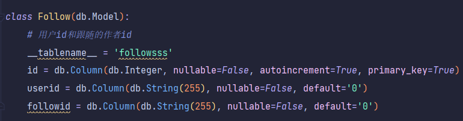

# RealWorld

github:[JingHuaZhao111/realworld (github.com)](https://github.com/JingHuaZhao111/realworld)

接口链接: https://www.apifox.cn/apidoc/shared-c0bd11df-b292-4192-8be8-ca5013638ae3  访问密码 : mpz03vpV 

## 数据库解释:

将每种类类型都建立表,利用多表联查查找

## 建立接口解释

### 用户

认证登录:只有当填入正确的邮箱和密码才能登陆成功返回200,并将user生成的uuid存入session中

注册账号:只有新姓名和邮箱才能注册成功

获取当前用户:利用session从数据库中查找到对应的当前用户的所有信息并返回,也必须处于登陆状态

更新用户:只能更新邮箱,自我介绍跟图片,必须处于登陆状态

注销用户:注销该用户

### 关注

获取查询的个人资料:可以根据是否登录返回不同的数据,像关注作者等只有登录才会显示,默认为false

关注查询的用户:非登录状态错误,只有在登录状态关注存在的用户才返回正确数据

取消关注用户:在登录非登录状态都可

### 文章

列出文章:T^T只能输一个参数返回对应的,输多个随缘

获取登录用户所关注的作者的所有文章:类似微信公众号推送

获得单篇文章:字面意思

创建文章:必须有题目,描述和主题,slug是在题目基础上将空格变成-

更新文章:!!!注意只有作者能够修改自己文章

删除文章:!!!注意当删除文章后tag对应的文章和tagname的关系也要删除,否则在列出文章时会查询到tag但是查询不到文章,只有作者能够删除自己的文章

### 喜爱文章

类似于收藏功能

## Http响应状态码

缺少参数:601

在数据库中unique的值提交数据出现重复:602

参数错误:603

需要身份认证:401

不能关注自己:604

文章作者评论不存在:404